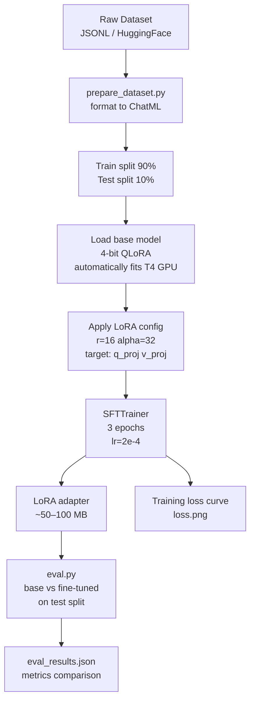
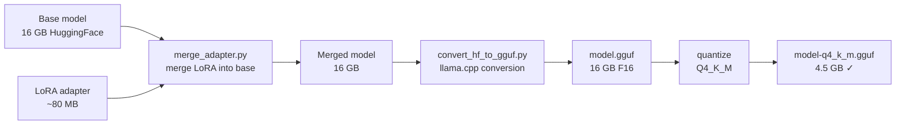
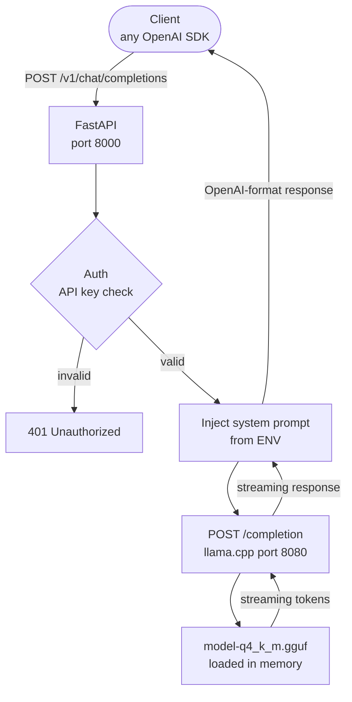
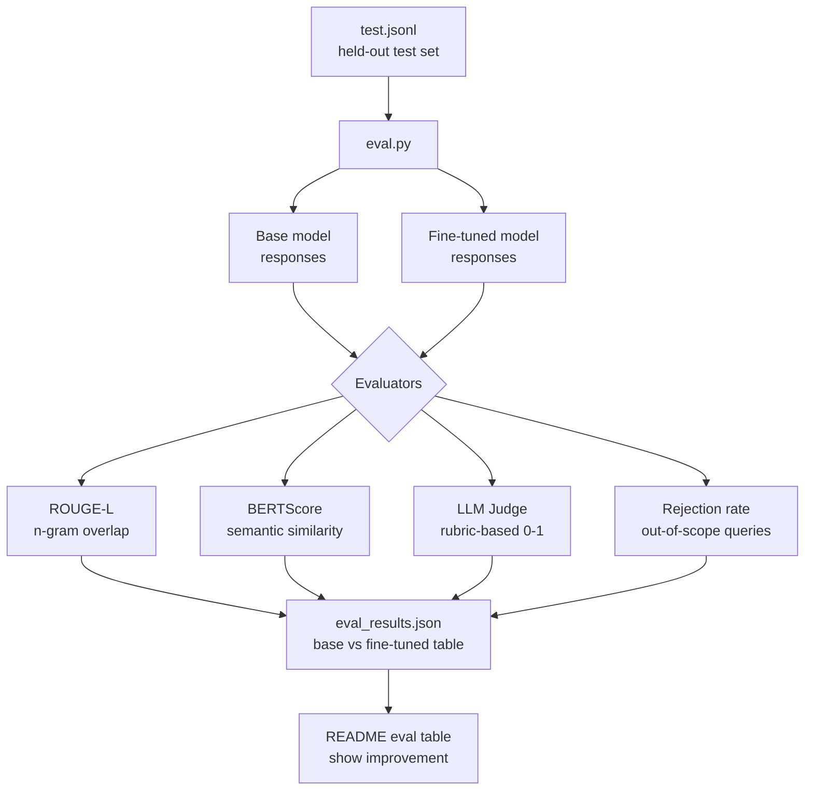

# LoraForge
### Fine-tune an open-source LLM on your domain, quantize it to run on a laptop, serve it as a free self-hosted API.

> **Update (2026-06-26):** The base model changed from Gemma 3n E4B to **Qwen3-4B-Instruct-2507**.
> Gemma 3n is multimodal and its Unsloth QLoRA support is experimental; training crashed in
> the forward pass (`Gemma3nRMSNorm` patch bug). Qwen3 4B is ungated, text-only, and fully
> supported by Unsloth, so no HF token is needed. Mentions of "Gemma 4 E4B" below are
> historical; see `README.md` and `CONCEPTS.md` for the current setup.

---

## Why Build This

This is the most technically impressive project in the series - and the one almost no portfolio has. Every other project calls an external LLM API. This one teaches you what's inside the box.

Fine-tuning is the skill that separates "AI engineer" from "prompt engineer." It shows interviewers you understand the full model lifecycle: training, adaptation, compression, and deployment. It's genuinely advanced, and this PRD is written to take you from zero to deployed even if you've never opened a model's weights before.

**What you'll learn:**
- How LoRA works - why you can fine-tune a 7B model in 2 hours on a free GPU
- QLoRA - running 4-bit quantized training to fit a large model on 16 GB VRAM
- GGUF and quantization - how a 16 GB model becomes a 4.5 GB file that runs on a laptop
- Inference serving - how `llama.cpp` runs the model and how to wrap it in an OpenAI-compatible API
- Evaluation - how to measure whether fine-tuning actually improved anything

**Why it stands out on a resume:**
Ask any AI engineer: "Have you fine-tuned a model?" Most say no. The ones who say yes almost always used a SaaS wrapper (Together AI, Replicate). Building the pipeline yourself - training script, quantization, serving, evaluation - is the full story. It's the project that gets you past the "you just call APIs" objection in interviews.

**Standalone value:**
Clone the repo, bring a JSONL dataset, run the Colab notebook, get a quantized model. Then `docker-compose up` for a self-hosted OpenAI-compatible API. No cloud dependencies after the model is built. Zero ongoing cost.

---

## Concepts Explained (Before the Technical Spec)

This section exists because fine-tuning involves unfamiliar vocabulary. Read this first.

**Base model:** A pretrained LLM (Llama 3 8B, Gemma 3 4B) trained by Meta or Google on trillions of tokens. You don't train this yourself - that costs millions. You start from here.

**Fine-tuning:** Continue training the base model on your own dataset. The model adapts its behavior to your domain without losing its general language understanding. Like giving an experienced employee a 2-week onboarding on your specific product.

**LoRA (Low-Rank Adaptation):** Instead of updating all 8 billion parameters (which would need 80+ GB VRAM), LoRA adds small "adapter" matrices to a subset of layers and only trains those. The adapter is typically 0.1–1% of the total parameters. The original model weights are frozen and unchanged.

**QLoRA:** Loads the base model in 4-bit precision during training, further cutting VRAM. This is how you fine-tune an 8B model on a T4 GPU (16 GB VRAM, available free on Colab).

**Quantization:** After training, compress the merged model from 16-bit floats to 4-bit integers. An 8B model goes from 16 GB → 4.5 GB. Quality loss is minimal. The format is called GGUF, used by `llama.cpp`.

**llama.cpp:** A C++ runtime that loads GGUF models and runs inference on CPU (or GPU). It also has a built-in HTTP server. This is how you serve the model without PyTorch.

---

## Problem

General-purpose LLMs have three limitations for domain-specific use cases:

| Problem | Why it matters |
|---|---|
| Hallucination on domain facts | GPT-4 confidently states wrong product specs, legal clauses, medical dosages |
| Expensive at scale | API calls for every query; cost grows linearly with usage |
| Data privacy | Every prompt sent to OpenAI/Anthropic leaves your infrastructure |
| Behavior inconsistency | Prompt engineering is fragile; model updates break workflows silently |

A fine-tuned, self-hosted model solves all four: trained on your facts, zero per-query cost, never leaves your machine, version-controlled behavior.

---

## What Gets Built

Three deliverables - each is standalone and reusable:

### 1. Training Pipeline
A Google Colab notebook + Python script that:
- Loads a base model in 4-bit (QLoRA)
- Loads and formats your dataset into ChatML format
- Runs LoRA training with sensible defaults
- Saves the adapter and a training loss plot
- Evaluates base vs. fine-tuned model on a held-out test set

### 2. Quantization Pipeline
A script that:
- Merges the LoRA adapter into the base model
- Converts to GGUF format using `llama.cpp`'s conversion tools
- Quantizes to Q4_K_M (best quality/size tradeoff)
- Outputs a single deployable `.gguf` file

### 3. Self-Hosted REST API
A Dockerized FastAPI service that:
- Wraps `llama.cpp`'s HTTP server
- Exposes an OpenAI-compatible `/v1/chat/completions` endpoint
- Enforces a configurable system prompt server-side
- Requires an API key for auth
- Works as a drop-in replacement for any OpenAI SDK client

---

## Architecture

### Training Pipeline



### Quantization Pipeline



### Serving Architecture



### Evaluation Flow



---

## Tech Stack

| Library | Version | Role | Why this |
|---|---|---|---|
| `transformers` | 4.40+ | Load + save HuggingFace models | Standard library for all HF models |
| `peft` | 0.10+ | LoRA adapter creation and training | The reference LoRA implementation |
| `trl` | 0.8+ | `SFTTrainer` - supervised fine-tuning loop | Simplest correct way to do SFT |
| `bitsandbytes` | 0.43+ | 4-bit quantized model loading (QLoRA) | Required for 4-bit base model loading |
| `datasets` | 2.x | Load HuggingFace datasets or local JSONL | Standard dataset handling |
| `llama.cpp` | latest | GGUF inference + HTTP server | C++ speed, no PyTorch at inference time |
| `fastapi` + `uvicorn` | latest | OpenAI-compatible API wrapper | Async, clean, familiar |
| Docker + Compose | latest | Reproducible serving environment | One-command deployment |
| `rouge_score` + `bert_score` | latest | Evaluation metrics | Standard NLP eval metrics |

**Training environment:** Google Colab Free (T4 GPU, 16 GB VRAM) - $0.  
**Serving environment:** Any machine with 8 GB RAM - no GPU needed.

---

## Dataset Format

LoraForge accepts a JSONL file in this format:

```jsonl
{"instruction": "What is your return policy?", "response": "We accept returns within 30 days..."}
{"instruction": "How do I reset my password?", "response": "Click Forgot Password on the login screen..."}
```

The training script converts this to ChatML:

```
<|im_start|>system
You are a helpful customer support assistant for Acme Corp. Never invent information you're not sure about.<|im_end|>
<|im_start|>user
What is your return policy?<|im_end|>
<|im_start|>assistant
We accept returns within 30 days of purchase for unused items in original packaging...<|im_end|>
```

**Minimum viable dataset:** 500 examples. Sweet spot: 2,000–5,000.

**Quick-start public dataset:** [Bitext Customer Support Dataset](https://huggingface.co/datasets/bitext/Bitext-customer-support-llm-chatbot-training-dataset) - 27K examples, free, no registration.

---

## Training Hyperparameters

```python
# Sensible defaults - explained in README, not magic numbers
lora_config = LoraConfig(
    r=16,              # adapter rank - higher = more capacity, more memory
    lora_alpha=32,     # scaling = 2x rank is standard
    target_modules=["q_proj", "v_proj", "k_proj", "o_proj"],
    lora_dropout=0.05,
    task_type="CAUSAL_LM",
)

training_args = SFTConfig(
    num_train_epochs=3,
    per_device_train_batch_size=2,
    gradient_accumulation_steps=4,   # effective batch = 8
    learning_rate=2e-4,
    fp16=True,
    max_seq_length=2048,
    output_dir="./lora-adapter",
)
```

The README explains what each parameter does, when to increase/decrease it, and what the training loss curve should look like.

---

## Quantization Quality Guide

| GGUF Format | File Size | RAM Needed | Quality vs FP16 |
|---|---|---|---|
| Q8_0 | ~8.5 GB | ~10 GB | Near-lossless |
| **Q4_K_M** | **~4.5 GB** | **~6 GB** | **Best tradeoff ← use this** |
| Q3_K_M | ~3.3 GB | ~5 GB | Slight degradation |
| Q2_K | ~2.7 GB | ~4 GB | Noticeable quality loss |

---

## Standalone Setup

### Training (Colab)
1. Open `notebooks/01-finetune-colab.ipynb` in Google Colab
2. Set runtime to T4 GPU
3. Upload your JSONL dataset or use the public Bitext dataset
4. Run all cells - adapter saved to Google Drive

### Quantization (local)
```bash
git clone https://github.com/yourusername/loraforge
cd loraforge
pip install -r requirements-train.txt

# Merge adapter + quantize
python scripts/merge_adapter.py --base meta-llama/Meta-Llama-3-8B-Instruct --adapter ./lora-adapter --output ./merged
bash scripts/quantize.sh ./merged model-q4_k_m.gguf
```

### Serving
```bash
cp model-q4_k_m.gguf models/
cp .env.example .env  # set API_KEY and SYSTEM_PROMPT
docker-compose up

# Test with curl
curl http://localhost:8000/v1/chat/completions \
  -H "Authorization: Bearer your-api-key" \
  -H "Content-Type: application/json" \
  -d '{"model": "local", "messages": [{"role": "user", "content": "What is your return policy?"}]}'
```

---

## Repo Structure

```
loraforge/
├── notebooks/
│   └── 01-finetune-colab.ipynb     # run on Google Colab T4 - full pipeline
├── scripts/
│   ├── prepare_dataset.py           # raw JSONL → ChatML JSONL
│   ├── train.py                     # same as notebook, for local/cloud runs
│   ├── merge_adapter.py             # merge LoRA → full model
│   └── quantize.sh                  # llama.cpp convert + quantize
├── serve/
│   ├── main.py                      # FastAPI OpenAI-compatible wrapper
│   ├── Dockerfile
│   └── docker-compose.yml
├── eval/
│   └── eval.py                      # base vs fine-tuned comparison
├── data/
│   ├── README.md                    # dataset format + public dataset links
│   └── sample_50.jsonl              # 50 examples to verify pipeline works
├── models/
│   └── .gitkeep                     # GGUF files go here (gitignored)
├── tests/
│   └── test_api.py                  # FastAPI endpoint tests
├── CONCEPTS.md                      # LoRA, QLoRA, GGUF explained plainly
├── PRD.md
├── README.md
├── requirements-train.txt           # transformers, peft, trl, bitsandbytes
├── requirements-serve.txt           # fastapi, httpx - no torch
└── .env.example
```

---

## Success Criteria

- Fine-tuned model scores ≥ 15% higher than base model on LLM-judge eval on the test set
- Out-of-scope rejection rate ≥ 80% (base model baseline: typically < 30%)
- Quantized model runs on 8 GB RAM laptop with < 2s response latency
- Full pipeline completable in one working day following only the README
- `/v1/chat/completions` passes OpenAI SDK compatibility test

---

## Resume Bullets (fill in numbers after building)

- Fine-tuned Llama 3 8B on a domain-specific dataset using QLoRA on a free Colab T4 GPU - 15%+ improvement over base model on LLM-judge evaluation with [N] test cases
- Applied Q4_K_M quantization via `llama.cpp` to compress a 16 GB model to 4.5 GB, enabling CPU-only inference on consumer hardware with < 2s response latency
- Served the fine-tuned model as an OpenAI-compatible REST API (`/v1/chat/completions`) via FastAPI + `llama.cpp`, Dockerized for one-command self-hosting with zero cloud dependency
- Implemented a 4-metric evaluation pipeline (ROUGE-L, BERTScore, LLM judge, rejection rate) showing quantified improvement of fine-tuned model over base model
