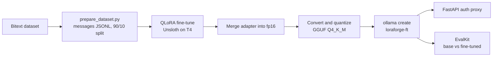
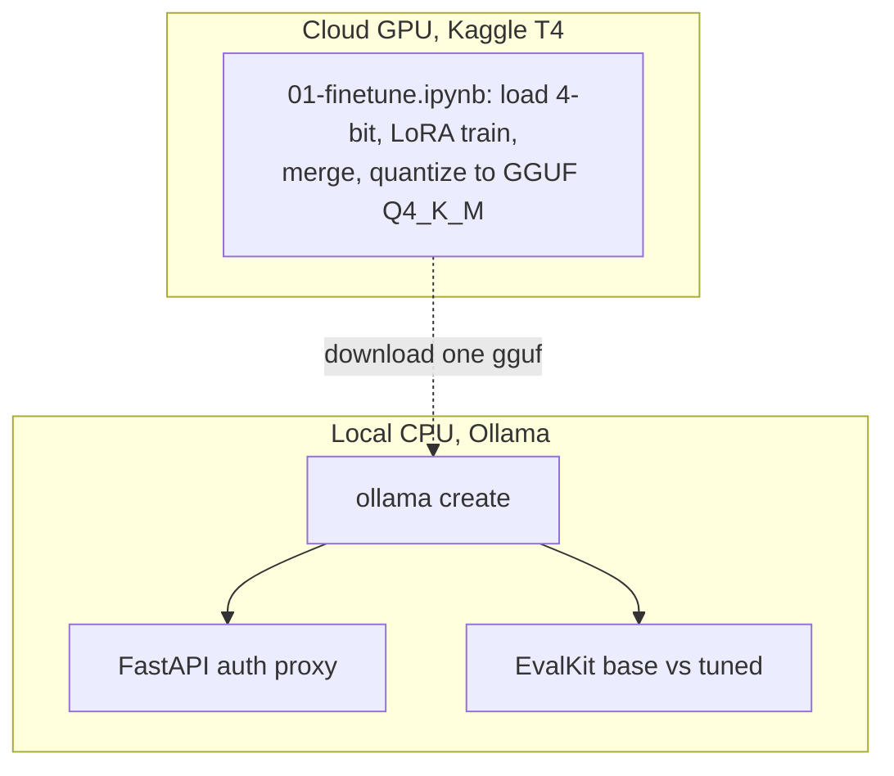
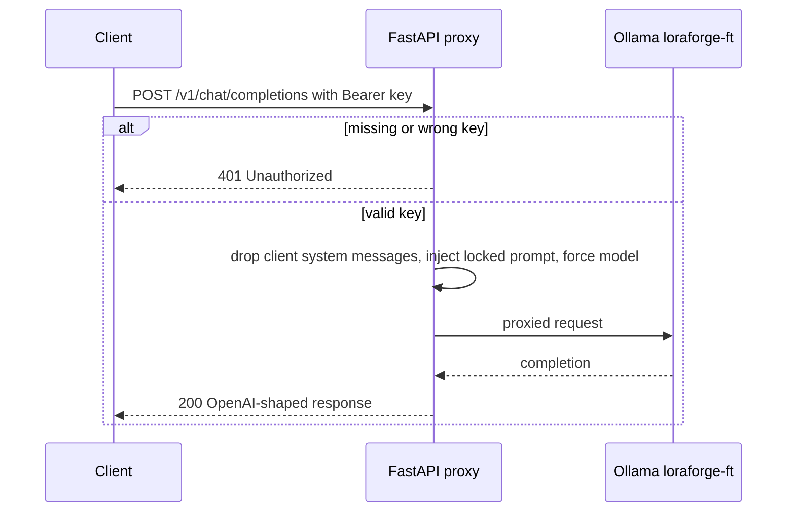
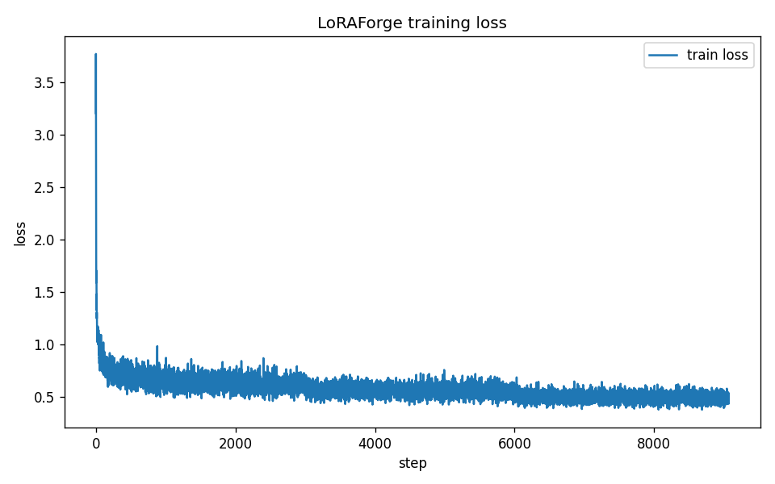

# LoRAForge

Fine-tune an open LLM on a domain, quantize it to GGUF, and serve it as a self-hosted,
OpenAI-compatible API. LoRAForge takes **Qwen3 4B Instruct**, QLoRA fine-tunes it on the
**Bitext customer-support** dataset with Unsloth, quantizes the result to a single
`Q4_K_M` GGUF, serves it through **Ollama** behind a thin **FastAPI** auth proxy, and grades
base versus fine-tuned with **EvalKit**.

Training runs on a free cloud T4 (Kaggle). Everything after training runs locally on CPU.

📦 **Model weights:** [`HamzaElSousi/loraforge-qwen3-4b-gguf`](https://huggingface.co/HamzaElSousi/loraforge-qwen3-4b-gguf) on the Hugging Face Hub (the 2.5 GB GGUF is not in this repo). See [Get the model](#get-the-model).

## Why this exists

It is the project that proves training and adapting a model, not just calling an API. The
whole pipeline is reproducible from this README in about one working day, and it plugs into
the rest of the series: LoRAForge produces the model, Ollama serves it, EvalKit grades it.

## Pipeline



The dashed line in the split below marks the one machine boundary: only a single `.gguf`
crosses from the cloud GPU back to the laptop.



## Get the model

The 2.5 GB fine-tuned GGUF is **not** in this repo (GitHub caps files at 100 MB); model
weights live on the **Hugging Face Hub**. You can download the released model or train your own.

**Download (fastest)** - pull it straight into Ollama:

```bash
ollama create loraforge-ft -f - <<< 'FROM hf.co/HamzaElSousi/loraforge-qwen3-4b-gguf:Q4_K_M'
```

or fetch the file and drop it in `models/`:

```bash
pip install huggingface_hub
hf download HamzaElSousi/loraforge-qwen3-4b-gguf loraforge-qwen3-4b-q4_k_m.gguf --local-dir models/
```

**Train your own** - run `notebooks/01-finetune.ipynb` on a free Kaggle T4 (see Quickstart),
then drop the resulting `.gguf` into `models/`.

## Repository layout

```
loraforge/
  scripts/
    prepare_dataset.py    raw {instruction,response} -> conversational JSONL, 90/10 split
    train.py              headless QLoRA fine-tune (mirror of the notebook)
    merge_adapter.py      fold the LoRA adapter into fp16 weights
    quantize.sh           convert fp16 HF model -> GGUF -> Q4_K_M (llama.cpp)
  notebooks/
    01-finetune.ipynb     the cloud-GPU run: train + merge + quantize, Run All
  serve/
    main.py               FastAPI: API-key auth + locked system prompt, proxies to Ollama
    Modelfile             ollama create input (FROM the GGUF, stop tokens, system prompt)
    Dockerfile            tiny CPU-only serving image (no torch)
  eval/
    suite-ft.yaml         EvalKit suite against the fine-tuned model
    suite-base.yaml       same cases against the base model (loraforge-base)
    eval.py               ROUGE-L + BERTScore supplement on the held-out split
  data/
    sample_50.jsonl       50-row smoke set to exercise the pipeline without the full dataset
  models/                 GGUF lands here (gitignored)
  tests/                  prepare_dataset + serving proxy tests (no GPU, no real model)
  CONCEPTS.md             LoRA / QLoRA / GGUF / chat templates explained
```

## Quickstart

### 1. Train on a free GPU (the only step that needs a GPU)

1. Open `notebooks/01-finetune.ipynb` on **Kaggle**, set the accelerator to **GPU T4**.
2. No Hugging Face token is needed: the Qwen3 base model and the Bitext dataset are both
   ungated.
3. Leave `SMOKE = True` for a quick ~60-step sanity run, or set it to `False` for the real
   3-epoch fine-tune. **Run All.**
4. Download `loraforge-qwen3-4b-q4_k_m.gguf` and `loss.png`. Put the `.gguf` in `models/`.

Prefer a headless box? `scripts/train.py` plus `scripts/merge_adapter.py` plus
`scripts/quantize.sh` do the same thing from the command line.

### 2. Serve it locally

```bash
# import the GGUF into Ollama
ollama create loraforge-ft -f serve/Modelfile

# run the auth proxy
cp .env.example .env            # set LORAFORGE_API_KEY to a long random string
pip install -r requirements-serve.txt
uvicorn serve.main:app --port 8000
# or: LORAFORGE_API_KEY=... docker compose up --build
```

Call it with any OpenAI client:

```bash
curl http://localhost:8000/v1/chat/completions \
  -H "Authorization: Bearer $LORAFORGE_API_KEY" \
  -H "Content-Type: application/json" \
  -d '{"messages":[{"role":"user","content":"How long do refunds take?"}]}'
```

```python
from openai import OpenAI
client = OpenAI(base_url="http://localhost:8000/v1", api_key="YOUR_LORAFORGE_API_KEY")
print(client.chat.completions.create(
    model="loraforge-ft",
    messages=[{"role": "user", "content": "How do I track my order?"}],
).choices[0].message.content)
```

A wrong or missing key returns 401. The system prompt is set server side and a client
cannot override it:



### 3. Evaluate base vs fine-tuned

```bash
# base model for comparison: same arch, no fine-tune, matching Q4_K_M quant
ollama create loraforge-base -f - <<< 'FROM hf.co/unsloth/Qwen3-4B-Instruct-2507-GGUF:Q4_K_M'
evalkit run eval/suite-ft.yaml   --out eval/reports/ft
evalkit run eval/suite-base.yaml --out eval/reports/base
# optional reference-based metrics on the held-out split:
python eval/eval.py --model loraforge-ft   --test data/test.jsonl
python eval/eval.py --model loraforge-base --test data/test.jsonl
```

## Results

Base `unsloth/Qwen3-4B-Instruct-2507` vs the fine-tuned `loraforge-ft`, both served as
`Q4_K_M` GGUF on Ollama (CPU). Numbers are from the EvalKit suites in `eval/` (10 cases: 6
in-scope support-quality, 4 out-of-scope rejection), judged by the local base model.
Final training loss was `0.57` over 3 epochs (`loss.png`).

| Metric | Base `loraforge-base` | Fine-tuned `loraforge-ft` | Target |
|---|---|---|---|
| Support quality (6 cases, LLM-judge) | 4/6 (67%) | **6/6 (100%)** | +15% over base (met: +33 pts) |
| Out-of-scope rejection (4 cases) | 2/4 (50%) | **3/4 (75%)** | >= 80% (close, not met) |
| Overall pass rate (10 cases) | 6/10 (60%) | **9/10 (90%)** | higher is better |
| ROUGE-L vs gold (40 held-out rows) | 0.191 | **0.400** | higher is better (+0.209) |
| Latency p50 / p95 (CPU) | 4.5s / 10.8s | 10.0s / 14.8s | < 2s (not met; 4B on CPU) |

The fine-tune lifts support quality to a clean sweep, roughly doubles the overall pass rate,
and more than doubles ROUGE-L against the gold support answers (its replies are much closer
to the dataset's style and content). Two honest caveats: out-of-scope rejection improves but
still misses the 80% bar (the Bitext data teaches helpfulness, not refusal), and the
fine-tuned model is slower per reply because it generates longer, more detailed support
answers. The `< 2s` latency goal is not realistic for a 4B model quantized to `Q4_K_M` on
CPU; it would need a GPU or a smaller model. The LLM judge here is the local base model, so
treat absolute scores as indicative and the base-vs-tuned delta as the signal. ROUGE-L was
run on a 40-row subsample of the held-out split (`eval/eval.py` scores the full ~2,700-row
split, which is slow on CPU).



## Tests

No GPU and no live model needed; the Ollama calls are mocked.

```bash
pip install -r requirements-serve.txt
pytest
```

## Notes

- The serving image has no torch. Inference is GGUF via Ollama and llama.cpp only.
- The 10 percent test split is held out before training so the model is never evaluated on
  data it trained on.
- To fine-tune a different domain, point `prepare_dataset.py` at your own
  `{instruction, response}` JSONL (500 rows or more recommended). The rest of the pipeline
  is unchanged.
- The base model is `unsloth/Qwen3-4B-Instruct-2507` (ungated, no token needed). To fine-tune
  a different base, set `BASE_MODEL` in the notebook and make sure the `Modelfile` stop token
  matches that model's chat template (Qwen and other ChatML models use `<|im_end|>`; Gemma
  uses `<end_of_turn>`).

See `CONCEPTS.md` for how LoRA, QLoRA, GGUF, and chat templates actually work.

## License

MIT. See `LICENSE`.
